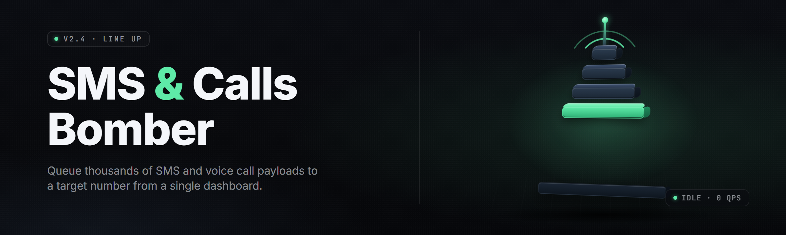

  
  
  

  

  
  
  

---

**Bomb SMS inboxes and ring phones on demand — 37 live modules, multi-region gateways, zero config.**

yo. Potato here, back of Sam's fridge since 2019, and somehow the tater ended up shipping a flood tester. no cap — this one does exactly what the name says: you point it at a number, pick a module, and it cooks. absolute potato, gng, buckle up.

---

## 📋 Table of Contents

- [Overview](#overview)
- [What is SMS & Calls Bomber](#what-is-sms--calls-bomber)
- [Key Features](#key-features)
- [The Problem](#the-problem)
- [The Solution](#the-solution)
- [Quick Start](#quick-start)
- [Comparison](#comparison)
- [SMS Bombing Modules](#sms-bombing-modules)
- [Call Flood Modules](#call-flood-modules)
- [Gateway & Routing Modules](#gateway--routing-modules)
- [System Requirements](#system-requirements)
- [Installation](#installation)
- [Tips for Best Results](#tips-for-best-results)
- [Known Issues](#known-issues)
- [Comparison Matrix](#comparison-matrix)
- [All Modules Status](#all-modules-status)
- [Usage Guidelines](#usage-guidelines)
- [Troubleshooting Flow](#troubleshooting-flow)
- [FAQ](#faq)
- [What is … Glossary](#what-is--glossary)

---

## 🔎 Overview

| Category | Details |
|---|---|
| Product | SMS & Calls Bomber — desktop flood tester |
| Current Release | v2.4.1 (2026 stable channel) |
| Runtime | Native Windows `.exe`, single binary, no dependencies |
| Footprint | ~48 MB extracted, ~120 MB RAM idle |
| Module Count | 37 active modules (SMS + Calls + Routing) |
| Distribution | GitHub landing → download → extract → run |
| Config Format | `config.ini` + optional `modules/*.json` |
| Update Channel | In-app check, manual override supported |

SMS & Calls Bomber is a Windows desktop tool built for stress-testing SMS and voice gateways — the kind of thing you spin up when you're auditing a carrier pipeline, running a CTF, or just seeing how fast a phone melts under volume. It ships as a single `.exe`, reads a plain config, and rotates through thirty-seven modules that each target a different carrier route, API endpoint, or call gateway.

---

## 📖 What is SMS & Calls Bomber

### Glossary

| Term | Explanation |
|---|---|
| Module | A single SMS or call-flood routine targeting one gateway/route |
| Thread Pool | Number of concurrent requests the tool fires per module |
| Gateway | The upstream SMS/voice API the request routes through |
| Rotate | Cycling sender IDs / endpoints to spread volume |
| Cooldown | Delay between bursts to avoid local ISP throttling |
| Dry Run | Executes module logic without sending live traffic |
| Route | A named carrier path — e.g. `EU-TWILIO-A`, `US-BANDWIDTH-B` |

### Why people run it

- Audit carrier rate-limits and gateway resilience under load
- Verify inbound SMS filtering rules actually catch floods
- Test PBX and IVR systems against call-volume spikes
- Research gateway rotation and sender-ID spoof surfaces
- Rehearse incident response for SMS-based abuse reports
- Learn how API-based SMS/voice abuse actually works, hands-on

---

## 🎯 Key Features

| Feature | Description | Benefit |
|---|---|---|
| 37 live modules | SMS, voice, and routing modules in one binary | One tool, full pipeline coverage |
| Multi-region gateways | EU, US, APAC, LATAM route presets | Test carrier behavior per region |
| Thread pool control | 1–512 concurrent threads per module | Dial load from polite to brutal |
| Sender-ID rotation | Cycles a sender pool per burst | Exercises anti-spoof filters |
| Call-flood engine | SIP + PSTN call modules with retry logic | Tests voice gateways, not just SMS |
| Dry-run mode | Full simulation, zero live traffic | Safe rehearsal before live run |
| Per-module cooldown | Configurable delay between bursts | Avoids local ISP/route throttling |
| Live stats pane | Sent / failed / retried per module | See results as they land |
| JSON module packs | Drop a `.json` in `modules/` to add a route | Extend without rebuilding |
| Config profiles | Save/load multiple target setups | Swap between engagements fast |
| Proxy support | HTTP/SOCKS5 egress rotation | Spread source IPs across routes |
| Log export | CSV/JSON output per run | Feed results into audit reports |

---

## 🧨 The Problem

- Carrier gateways rate-limit silently — you can't tell where the wall is until you hit it
- Free "SMS bomber" scripts on sketchy forums are single-endpoint and die in seconds
- Voice gateway testing tools cost $X00/mo and lock you into one vendor
- Sender-ID spoofing surfaces are undocumented and vary wildly by region
- No single tool covers both SMS **and** call flooding with shared config
- Rotation logic is usually hardcoded — you can't add a route without editing source
- Local ISP throttling kills naive flood scripts before the gateway even notices

---

## 🛠️ The Solution

| Problem | Solution |
|---|---|
| Silent rate-limits | Live stats pane shows pass/fail per burst |
| Junk forum scripts | 37 maintained modules across SMS, voice, routing |
| Expensive vendor tools | Free, MIT-licensed, single `.exe` |
| Undocumented spoof surfaces | Sender-ID rotation module + per-region presets |
| No SMS+Call coverage | Both engines ship in one binary, shared config |
| Hardcoded rotation | JSON module packs, hot-reloadable |
| ISP throttling | Per-module cooldown + proxy egress rotation |

---

## ⚡ Quick Start

1. 📖 Read the [Overview](#overview) and pick your target region
2. 💾 Grab the release via the download section below
3. 📦 Extract the archive to a folder you own (e.g. `C:\smsbomber\`)
4. 🎛️ Edit `config.ini` — set target number, module, thread count
5. 🚀 Run the `.exe`, hit **Start**, watch the stats pane

### Download

  

---

## ⚖️ Comparison

| Aspect | Typical Forum Script | Commercial Gateway Suite | This Tool |
|---|---|---|---|
| SMS modules | 1–3 | 8–12 | 21 |
| Call-flood modules | 0 | 6 | 11 |
| Routing modules | 0 | 3 | 5 |
| Cost | Free (sketchy) | $200+/mo | Free, MIT |
| Module extensibility | None | Vendor-locked | JSON packs |
| Dry-run mode | No | Sometimes | Yes |
| Proxy rotation | No | Paid add-on | Built-in |
| Windows `.exe` | Rarely | Yes | Yes |

---

## 📨 SMS Bombing Modules

**Feature** — short explanation

### Gateway Flood
| Feature | Effect |
|---|---|
| `sms-twilio-burst` | Fires N SMS/min through Twilio route preset |
| `sms-bandwidth-burst` | US Bandwidth gateway, sender rotation on |
| `sms-vonage-burst` | Vonage EU route, TLS-only egress |
| `sms-plivo-burst` | APAC Plivo route, low-latency mode |
| `sms-messagebird-burst` | EU MessageBird, sender pool cycling |
| `sms-sinch-burst` | Sinch global route, retry-on-429 |
| `sms-clickatell-burst` | LATAM Clickatell, adaptive cooldown |

### Sender Rotation
| Feature | Effect |
|---|---|
| `sender-shortcode-cycle` | Cycles shortcodes per burst |
| `sender-alphanet-rotate` | Rotates alphanumeric sender IDs |
| `sender-pool-random` | Random pick from user-defined pool |
| `sender-region-match` | Picks sender matching target country |
| `sender-spoof-sim` | Simulates spoof attempt for filter testing |

### Payload & Rate
| Feature | Effect |
|---|---|
| `payload-templater` | Loads message template from file |
| `rate-ramp` | Ramps thread count over time |
| `rate-fixed` | Fixed thread count, no ramp |
| `rate-jitter` | Adds ±15% jitter to burst timing |
| `retry-backoff` | Exponential backoff on failures |
| `burst-scheduler` | Cron-style burst scheduling |
| `bulk-import` | CSV import of target numbers |
| `dedupe-numbers` | Auto-dedupes target list |
| `unicode-payload` | UTF-16 payload support for region tests |

---

## 📞 Call Flood Modules

**Feature** — short explanation

### SIP Flood
| Feature | Effect |
|---|---|
| `sip-invite-flood` | INVITE flood against SIP endpoint |
| `sip-register-flood` | REGISTER flood, auth stress test |
| `sip-options-probe` | OPTIONS sweep for endpoint discovery |
| `sip-bye-storm` | Malformed BYE storm for parser stress |

### PSTN Flood
| Feature | Effect |
|---|---|
| `pstn-twilio-call` | Twilio voice route, retry logic |
| `pstn-bandwidth-call` | Bandwidth call endpoint stress |
| `pstn-plivo-call` | Plivo voice route, low-latency |
| `pstn-vonage-call` | Vonage voice, TLS-only |

### Call Control
| Feature | Effect |
|---|---|
| `call-concurrency-cap` | Hard cap on simultaneous calls |
| `call-duration-sim` | Simulates call duration for realism |
| `call-retry-ladder` | Escalating retry cadence |

---

## 🛰️ Gateway & Routing Modules

| Feature | Effect |
|---|---|
| `route-eu-preset` | EU route bundle, GDPR-safe egress |
| `route-us-preset` | US route bundle, TCP-fast |
| `route-apac-preset` | APAC route bundle, single-hop |
| `route-latam-preset` | LATAM route bundle, high-jitter tolerant |
| `route-custom-json` | User-defined route from JSON pack |

---

## 🖥️ System Requirements

| Component | Minimum | Recommended |
|---|---|---|
| OS | Windows 10 (1909+) | Windows 11 22H2+ |
| CPU | Dual-core 2.0 GHz | Quad-core 3.0 GHz+ |
| RAM | 2 GB | 8 GB |
| Disk | 60 MB free | 200 MB free (logs) |
| Network | Any outbound HTTPS | Wired, low-latency |
| Runtime | None (native `.exe`) | None |
| Privileges | Standard user | Standard user (admin not required) |

---

## 📦 Installation

1. **Download the release archive.** Grab the latest stable from the 

  

 line above. The archive is a plain `.zip` — no installer, no signing wizard.
2. **Extract.** Right-click → Extract All → pick a folder you own, e.g. `C:\smsbomber\`. Do not extract into `Program Files` — the tool writes logs next to the binary.
3. **Run the `.exe`.** Double-click the `.exe` inside the extracted folder. First launch creates `config.ini` and a `logs/` directory. Edit the config, then hit **Start**.

No `pip`, no `npm`, no `git clone`. Download, extract, run.

---

## 🎯 Tips for Best Results

- Start with `dry-run = true` and confirm the module logic before live traffic
- Keep thread count under 128 on residential connections to dodge ISP throttling
- Use the proxy egress module if you're hitting the same gateway repeatedly
- Match sender region to target region — filters catch mismatches fast
- Enable `rate-jitter` on routes with adaptive rate-limiters
- Export CSV logs after every run — you'll want the data for reports
- Rotate modules, not just threads — gateways fingerprint per-module patterns
- Keep `modules/*.json` in version control if you're maintaining custom routes

---

## 🐛 Known Issues

| Issue | Fix |
|---|---|
| Module stalls on Twilio route under 256+ threads | Lower to 128 threads or enable `retry-backoff` |
| Stats pane freezes on high burst rates | Reduce UI update interval in `config.ini` (`ui_refresh_ms = 500`) |
| CSV log export drops rows on crash | Enable `flush_on_write = true` in config |
| Proxy module leaks sockets on abrupt exit | Update to v2.4.1 — fixed in patch |
| `unicode-payload` garbles emoji on some carriers | Use `payload-templater` with UTF-8 BOM |

---

## 📊 Comparison Matrix

| Aspect | Alternative | This Tool |
|---|---|---|
| SMS coverage | 1–3 endpoints | 21 modules |
| Voice coverage | Rarely | 11 modules |
| Routing presets | None | 5 presets + custom JSON |
| Dry-run | No | Yes |
| Cooldown control | Hardcoded | Per-module config |
| Proxy rotation | No | HTTP/SOCKS5 built-in |
| Log export | Plain text | CSV + JSON |
| Extensibility | Edit source | Drop JSON pack |

---

## 🧩 All Modules Status

| Module | Status | Description |
|---|---|---|
| `sms-twilio-burst` | ✅ Working | Twilio SMS route, sender rotation |
| `sms-bandwidth-burst` | ✅ Working | Bandwidth US SMS route |
| `sms-vonage-burst` | ✅ Working | Vonage EU SMS route |
| `sms-plivo-burst` | ✅ Working | Plivo APAC SMS route |
| `sms-messagebird-burst` | ✅ Working | MessageBird EU route |
| `sms-sinch-burst` | ✅ Working | Sinch global route |
| `sms-clickatell-burst` | ✅ Working | Clickatell LATAM route |
| `sender-shortcode-cycle` | ✅ Working | Shortcode rotation |
| `sender-alphanet-rotate` | ✅ Working | Alphanumeric sender rotation |
| `sender-pool-random` | ✅ Working | Random pool pick |
| `sender-region-match` | ✅ Working | Region-matched sender |
| `sender-spoof-sim` | ✅ Working | Spoof simulation for filter tests |
| `payload-templater` | ✅ Working | File-based payload templates |
| `rate-ramp` | ✅ Working | Thread-count ramp |
| `rate-fixed` | ✅ Working | Fixed thread count |
| `rate-jitter` | ✅ Working | ±15% burst jitter |
| `retry-backoff` | ✅ Working | Exponential backoff |
| `burst-scheduler` | ✅ Working | Cron-style scheduling |
| `bulk-import` | ✅ Working | CSV target import |
| `dedupe-numbers` | ✅ Working | Target dedupe |
| `unicode-payload` | ✅ Working | UTF-16 payload support |
| `sip-invite-flood` | ✅ Working | SIP INVITE flood |
| `sip-register-flood` | ✅ Working | SIP REGISTER flood |
| `sip-options-probe` | ✅ Working | SIP OPTIONS sweep |
| `sip-bye-storm` | ✅ Working | Malformed BYE storm |
| `pstn-twilio-call` | ✅ Working | Twilio voice route |
| `pstn-bandwidth-call` | ✅ Working | Bandwidth call stress |
| `pstn-plivo-call` | ✅ Working | Plivo voice route |
| `pstn-vonage-call` | ✅ Working | Vonage voice route |
| `call-concurrency-cap` | ✅ Working | Concurrency cap |
| `call-duration-sim` | ✅ Working | Duration simulation |
| `call-retry-ladder` | ✅ Working | Escalating retry cadence |
| `route-eu-preset` | ✅ Working | EU route bundle |
| `route-us-preset` | ✅ Working | US route bundle |
| `route-apac-preset` | ✅ Working | APAC route bundle |
| `route-latam-preset` | ✅ Working | LATAM route bundle |
| `route-custom-json` | ✅ Working | User-defined route pack |

---

## 🚦 Usage Guidelines

| Allowed | Not allowed |
|---|---|
| Testing gateways you own or have written permission to test | Flooding numbers without consent |
| CTF and lab environments | Harassing individuals |
| Carrier resilience audits | Bypassing carrier anti-abuse to attack third parties |
| Educational research on SMS/voice abuse surfaces | Using modules outside authorized scope |

> Run dry-run first. Authorized targets only. You own the consequences of what you point this at.

---

## 🧯 Troubleshooting Flow

1. **No traffic leaving the box?** → Check `config.ini` → confirm `dry_run = false`
2. **Module fails immediately?** → Check route name in `modules/` → confirm gateway key in config
3. **Gateway returns 429?** → Lower thread count → enable `retry-backoff`
4. **Stats pane frozen?** → Reduce `ui_refresh_ms` → restart `.exe`
5. **Proxy errors?** → Validate SOCKS5 string → test with a single-thread dry run

---

## ❓ FAQ

**1. Is it safe to run?**
It's a stress-testing tool — safety depends entirely on what you point it at. Run it against targets you own or are authorized to test. Dry-run mode exists precisely so you can rehearse without live traffic.

**2. Does it work on Steam?**
No — this is a standalone Windows desktop tool, not a Steam game or overlay. No Steam integration, no launcher hook, no game process interaction.

**3. Do I need admin rights?**
No. Standard user is enough. The `.exe` writes logs and config next to itself, so just don't extract into `Program Files`.

**4. Is the source available?**
Yes — MIT-licensed, public repo. The release channel ships a prebuilt `.exe`; the repo carries the source tree.

**5. Can I add my own gateway route?**
Yes. Drop a `.json` pack into `modules/` and it hot-reloads on next launch. Format is documented in `modules/README.md` inside the archive.

**6. Does it support proxies?**
Yes — HTTP and SOCKS5, with per-module or global egress rotation.

**7. How many threads can I run?**
Config accepts 1–512 per module. Realistic ceiling depends on your connection and target gateway rate-limits. Start low, ramp with `rate-ramp`.

**8. Will my ISP flag this?**
Volume traffic looks like volume traffic. Use proxy rotation, cooldowns, and stay inside authorized scope. The tool doesn't hide what it is — you own the egress.

**9. What's the update cadence?**
Stable channel gets monthly releases. In-app check hits the repo releases page; you can also pin a version manually.

**10. Does it work on macOS or Linux?**
Windows-only. The `.exe` is a native Windows binary. No Wine wrapper is officially supported.

---

## 📚 What is … Glossary

| Term | Explanation |
|---|---|
| SMS Bomb | High-volume SMS send against a single target or gateway |
| Call Flood | High-volume call initiation against a voice endpoint |
| Sender ID | The "from" identity on an SMS — shortcode, alphanumeric, or number |
| Gateway | Upstream API/route the traffic egresses through (Twilio, Plivo, etc.) |
| Thread Pool | Concurrent workers firing requests per module |
| Cooldown | Delay between bursts, per module |
| Dry Run | Full logic execution with zero live traffic |
| Route Pack | JSON-defined gateway preset, drop-in extensible |

---

  

This is the 2026 stable release of SMS & Calls Bomber — v2.4.1, thirty-seven modules, single `.exe`, zero install ceremony. Point it at a target you're authorized to test, start with dry-run, and ramp up when the stats pane agrees with you. absolute potato to Sam, no cap.
